# Airport Management system - Team Apex

[Link to Sprint Journal](https://docs.google.com/spreadsheets/d/1jW__MfwpJe4qR5bUFEQO8qaOWe4k9hlOCn7Rn-ld3Rg/edit?usp=sharing) 

[Link to Sprint Report](https://docs.google.com/spreadsheets/d/1bPGKYoD9KSg5mKmD_Mke0I3cvmJmU00t/edit?usp=sharing&ouid=112507702670776021584&rtpof=true&sd=true) 

[Deployed Application link](http://13.56.164.236/)

(Note: Open all sheets links using SJSU mail)

# Team Members:
1. Fnu Butul Parveen
2. Pragnesh Bagary
3. Sagar Sutar
4. Vaibhav Ingale

# Contributions

1. Fnu Butul Parveen : Worked on the Signup, UserProfile, Login and logout backend functionality for 3 different login roles for passenger,Airline and Airport Employee. Performed deployment for backend on AWS autoscaling EC2 with load balancer.Also Created a Deployment diagram and Activity Diagram.

2. Pragnesh : Acted as the scrum master, worked on the carousel bookings functionality on front and also completed the airline employee component. Also created a architetcture diagram.

3. Vaibhav Ingale : Worked on flight arrivals and departures crud. Random gate assignments with respect to terminal backend components. Handled the logic for gate assignment in various conditions like put gate in maintaninace. All Mongodb aggregation pipelines created. Carousel assignemnt logic created. Also contibuted to all diagrams. Handled the gates and carousels expiry with caching server.

4. Sagar Sutar  : Created wireframes for the project such as login/signup, carousels, flights, schedules etc and also worked on Signup/Register User Profile, Login/Logout UI. Also created Use Case diagram and class diagram.

# Tech Stack:
- Frontend - VueJS

- Backend - NodeJS

- Database - MongoDB

- Cloud Deployment - AWS

# Tools Used

- Tool used for drawing the Wireframes: page to wireframe

- Backend Deployment : AWS EC2 AutoScaling LoadBalance

- Version Control: Visual Studio Code, Git

# Scrum Meetings Schedule:
Every Monday and Wednesday.

# Documentation
- Project Dashboard for tracking tasks
- Journal
- Sprint Sheet
- GitHub Repo

# Diagrams
- Architecture Diagram

  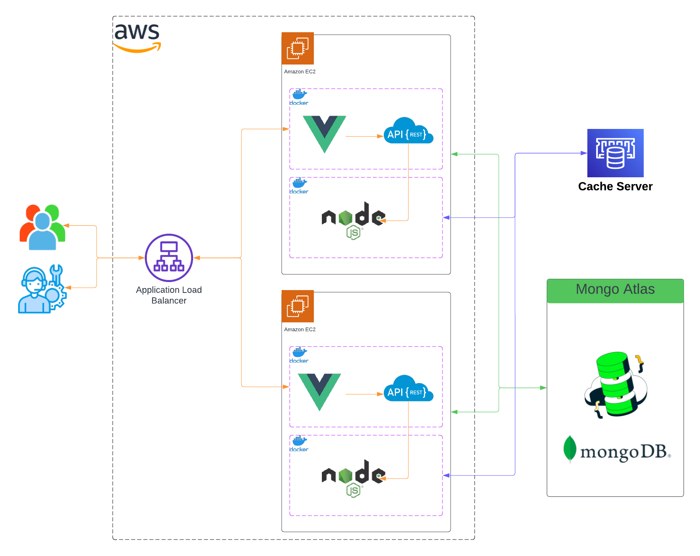

- Class diagram
  
  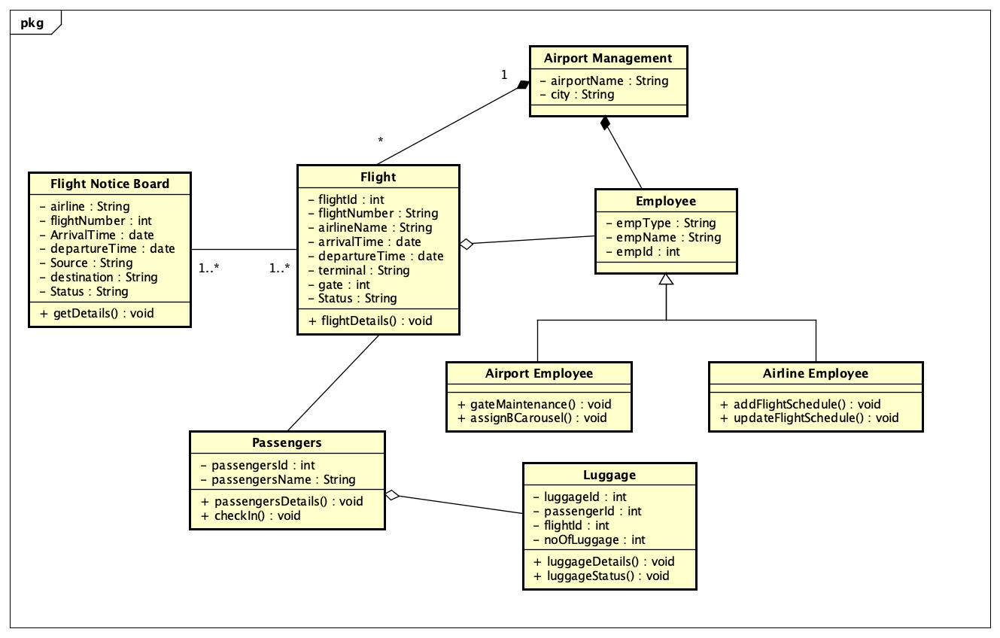
- Component Diagram
  
  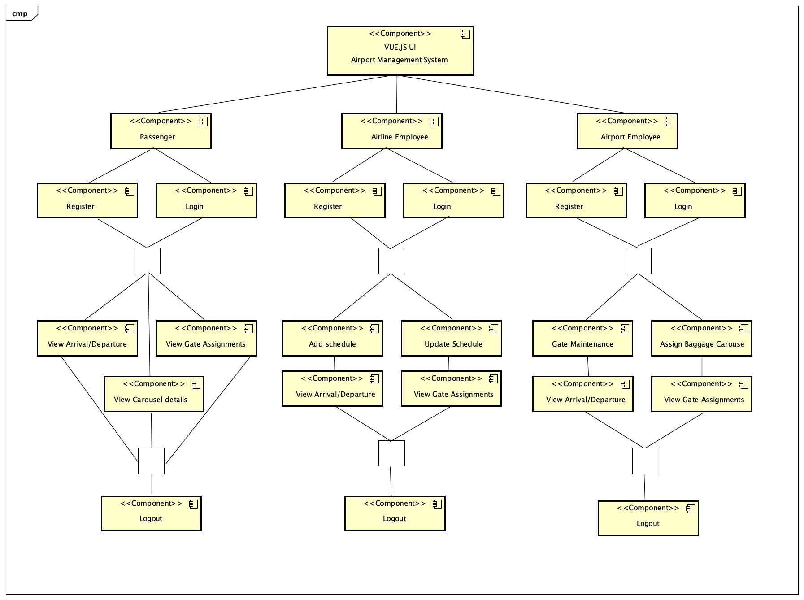
- Deployement Diagram
  
  
- Use case Diagram
  
  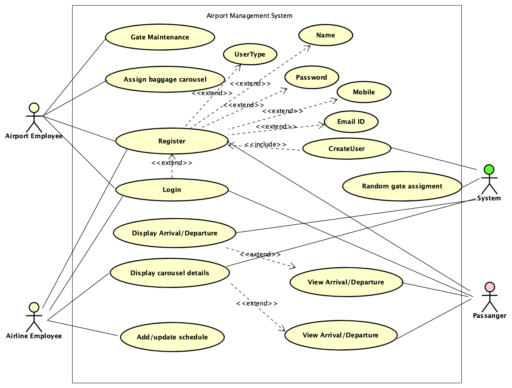

# XP Core Values 

#### Fnu Butul Parveen - Communication
Throughout the project, Butul supported this XP core value. She helped with the front-end development of the project. She accepted the duty of overseeing every aspect of the team project's activities. This essential idea helped us throughout the process by ensuring that we could all complete the project's requirements in the specified amount of time. It also enabled us to monitor our advancement at the conclusion of each sprint.

## Pragnesh - Feedback

Pragnesh was instrumental in advancing this XP core concept. He provided frequent feedback during the sprints, which allowed us to bounce fresh ideas off of one other and get better with each sprint. He has made a concerted effort to spend less time on each duty that depends on the others. His expertise and understanding were extremely helpful during the project's implementation.

## Vaibhav Ingale - Simplicity
Vaibhav helped to uphold this XP principle. Throughout the project, he made sure the process workflow was upheld. He was in charge of the backend of the program. Throughout the project, he guaranteed complete transparency, integrity, and unwavering dependability. The team was better able to understand the overall project concept thanks to his prior experience with this technological stack. His expertise and understanding were extremely helpful during the project's implementation. He also gave the tasks that needed to be done based on priority.

## Sagar Sutar - Courage

Sagar supported this XP core principle. He helped with the front-end development of the project. Sagar is a someone that can always tell the truth, no matter what. He gave us practical advice on how to solve each issue while considering all potential outcomes. He took the initiative to begin studying all of the cutting-edge technology needed to carry out this job on our behalf, which helped with the initial setup stage. Even in the most challenging situations, Sarvesh kept the team motivated and assisted us in coming up with a solution.

## Every Team member worked on - Respect
Respect We all helped to uphold this XP principle. We made sure that everyone on the team felt valued and respected while working together. Every viewpoint and thought was respected. Each team member took the time to hear the views, opinions, and ideas of the others. Members of the team worked hard to guarantee that the project would be of the greatest caliber and that there would be no delays. Adopting the other four XP values appropriately helped to secure respect as well.

# AWS EC2 with Load Balancer Deployment Screenshots

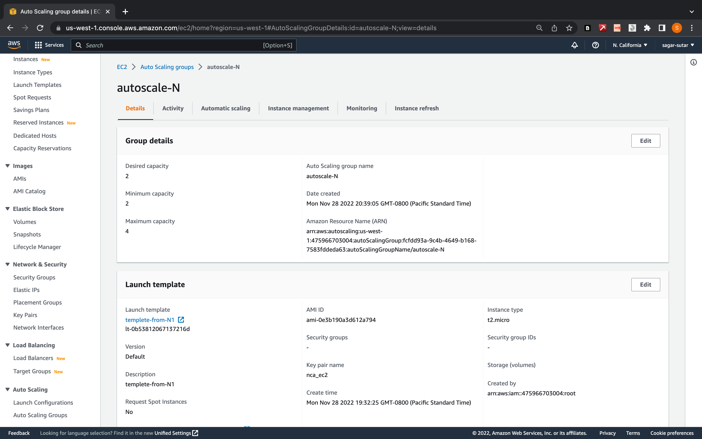
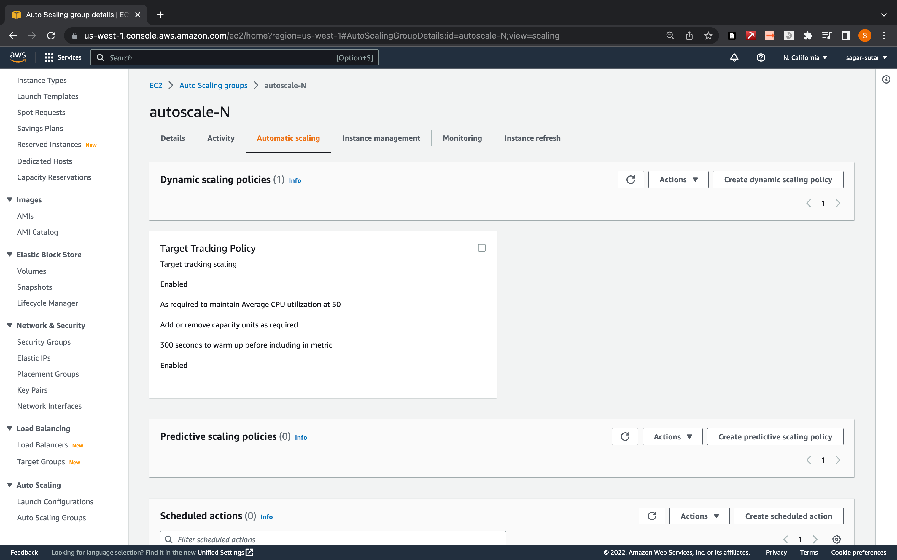
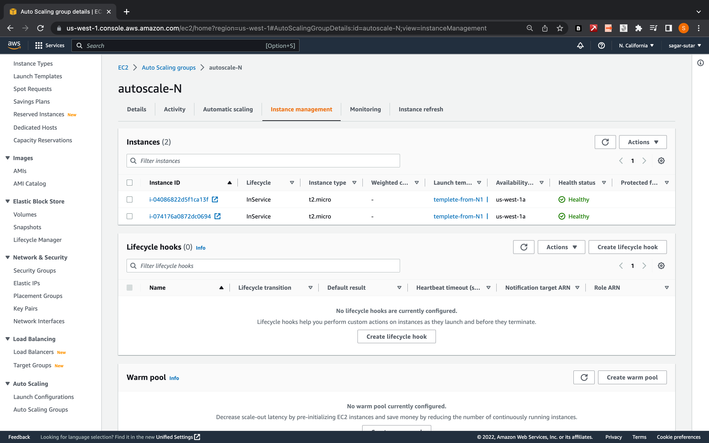
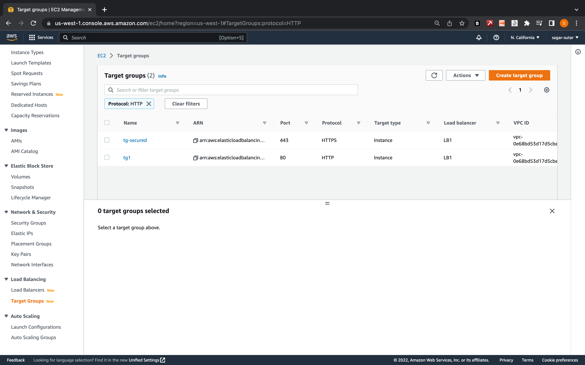

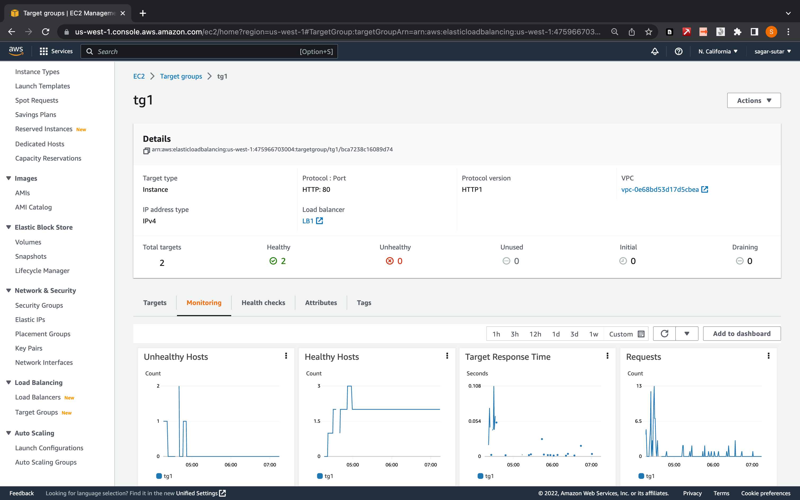
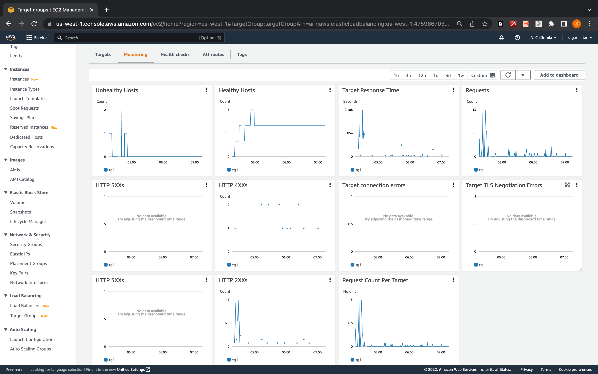
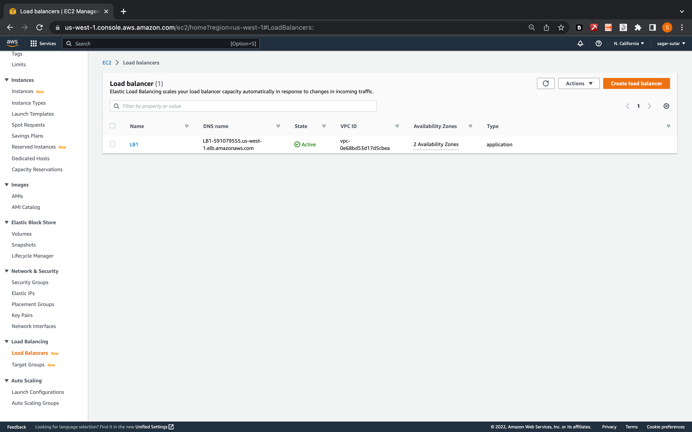

# Steps to test and run the application

1. Clone the repository git clone https://github.com/vaibhavingale-sjsu/airport-main.git

2. Run server
- For Backend Inside api_server/airport_main folder, run npm i then npm start
- For Backend cache Inside api_server/airport_cache folder, run npm i then npm start

3. For Frontend Inside frontend folder, run npm install vue and run then npm start

4. The web application opens in the default browser

# Design Decision:

We have used observer pattern for splitting the task of carousel and gate assigment tracking. Here we publish the schedule information and gate to cache server and then it publish back to api server once the assigned time is expired. Similarly, when any baggage is assigned it wil be published to cache server and once the cache server expires the record it will call the api to handle the next actions.

Chain of Responsibility design pattern Chain of Responsibility is a behavioral design pattern that lets you pass requests along a chain of handlers. Upon receiving a request, each handler decides either to process the request or to pass it to the next handler in the chain. We have used it to log the data for each route.

Singleton design pattern Singleton is a creational design pattern that lets you ensure that a class has only one instance, while providing a global access point to this instance. Singleton design pattern for the database.

# Why NoSQL in a database?

Instead of utilizing a relational model, we chose NoSQL because it has its own access languages to understand the data being saved.It has a developer-centric database, which facilitates access to application programming interfaces and database architecture.Before using a database, developers don't need to bother learning about its internal workings.NoSQL databases allow the freedom to work on what is necessary as opposed to pushing the database's schema on it.

# Why use MongoDB?

Mongo DB supports several data hierarchies.gives the Datamodel flexibility because of the secondary indexes.Because Mongo DB is schemaless, we don't define the schema at the beginning.

# Why the MERN Stack

UI rendering and performance React JS is the best when it comes to abstraction of the UI layer. You can create the application and arrange the code however you choose because React is just a library. As a result, it renders UIs faster and performs better than Angular.

Budget-Friendly A company would benefit from hiring only Javascript experts rather than specialists for each technology since MERN Stack uses only Javascript throughout. This choice will result in time and financial savings.

Open Source Software is available for free. MERN uses only open-source software and hardware. With the help of this functionality, developers can find solutions to problems that can come up while working on a project in the readily available open sources.

# Hosting on Amazon EC2 with Load Balancer

Web scale computing is simple because applications can scale themselves up and down dynamically based on their needs.

RELIABLE: Amazon EC2 provides a highly reliable environment that enables quick and predictable commissioning of replacement instances.

INEXPENSIVE You receive the financial advantages of Amazon's scale through Amazon EC2. You just pay for the amount of computing power that you really use. For student developers delivering smaller applications, it is technically free.

# Feature Set

# Application Level : Airport Employee Features

1. Register/Log-IN role such as Airport Employee but here acting as admin as  Airport Employee for application.

2. View all Flights such as arriving flights and departure flights based on duration of time

3. System will be able to assign random gate for Arriving and Departing flights

4. Airport employee will enable or disable one or more gates for maintenance

5. Airport employee can assign Baggage Carousel number to Arriving flights

6. Airport epmloyee will assign baggage carousel number to arriving flights the system will prevent the conflict assignments

7. Baggage Claim information will be displayed in multiple monitors in the Arrival area airport employee can able to view.

# Application Level : Airline  Employee Features

1. Register/Log-IN role such as Airport Employee but here acting as admin as  Airline Employee for application.

2. View all Flights such as arriving flights and departure flights based on duration of time

3. System will be able to assign random gate for Arriving and Departing flights

4. Airline epmloyee will be able to add or update the schedule of flights belonging to their airline relevant to that airport (arrivals and departures)

5. Baggage Claim information will be displayed in multiple monitors in the Arrival area airport employee can able to view.

6. View gate assignments for arrival and departure.

7. Airline  arriving from terminal- gate- baggage claim 

# Passenger Features

1. Register/Log-IN role such as Airport Employee but here acting as admin as  Airline Employee for application.

2. View all Flights such as arriving flights and departure flights based on duration of time

3. View gate assignments for arrival and departure

4. View baggage carousel information of arrival flights

# Related features other than roles:

1. Gates are distributed in multiple terminals 

2. Gates are labeled as A1-A32, B1-B32 and C1-C32 with 10 baggage carousels.

3. Deployed API's to AWS in an Auto Scaled EC2 Cluster with Load Balancer for the complete application.

4. Developed a Web UI that will make use of the APIs and integrated with backend database to frontend UI.

5. Created our own database with mock data - using SFO or SJC as an example airport for our data for project.

6. Retrieved Flight arrivals and departures and Gate assignments - based on time durations (next for 1 hour, next 2 hours, next 4 hours) - this data will be displayed in multiple monitors throughout the airport - viewable by all users

7. Implemented a Random Gate assignment for Arriving and Departing flights - designed to prevent conflicting assignments - allow for an hour for each flight to be at the gate (for arrivals and for departures)

8. APIs - input and output of API it will be in JSON and included with error handling and validation of inputs.

9. APIs will be demonstrated using a Web UI

10.UI is accessed by Passengers (Customers) and Airline employees and Airport employees with different 3 roles.

11.Get API by flightArrival 

12.Get API by FlightDeparture 

13.Get API by GateAssignments 

# UI Screenshots
## Register

## Login

## Departure 

## Arrivals
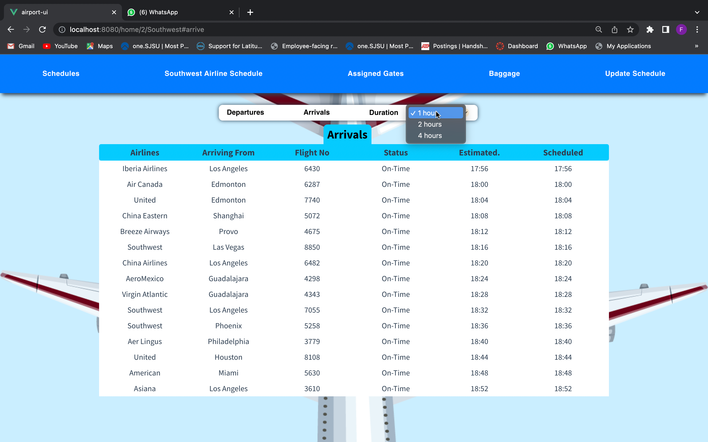
## Assigned departure gates
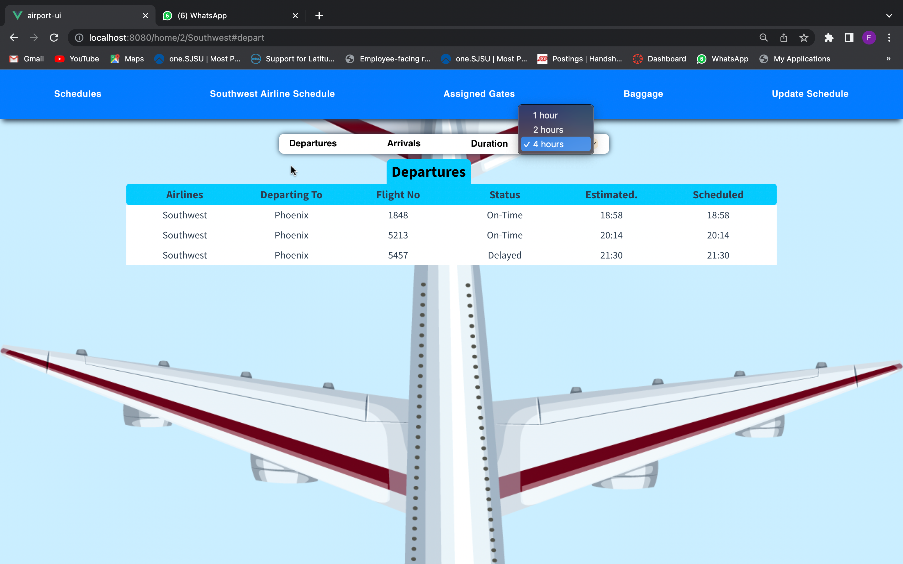
## Add flight to schedule
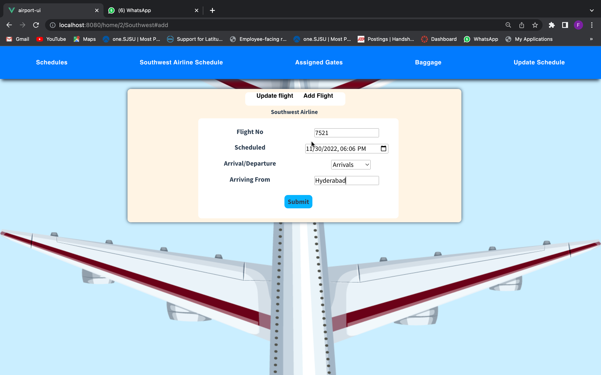
## Update flight schedule
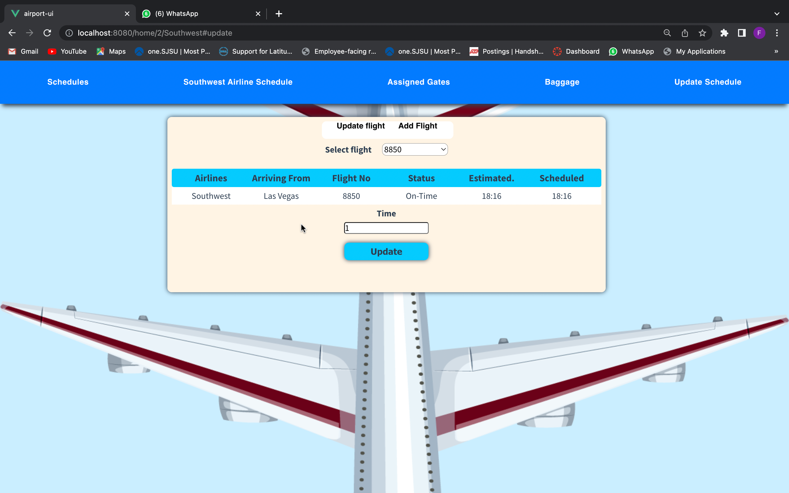
## Gate maintainance

## Assgin baggage carousel
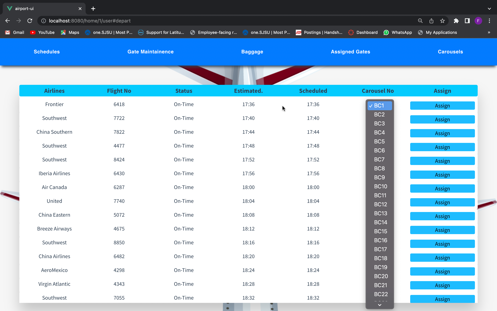
## Assigned baggage with carousel number
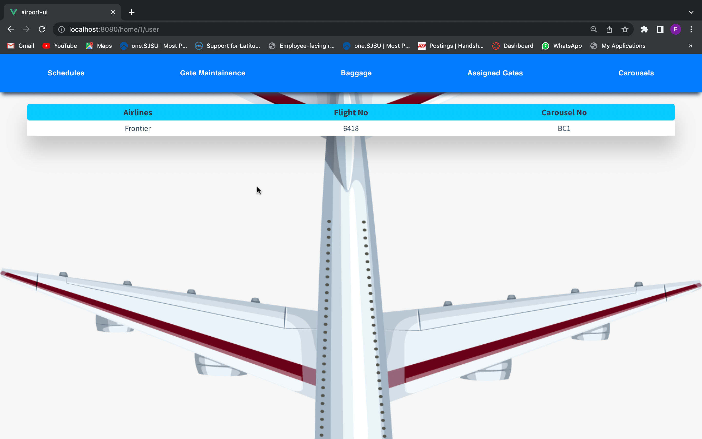

